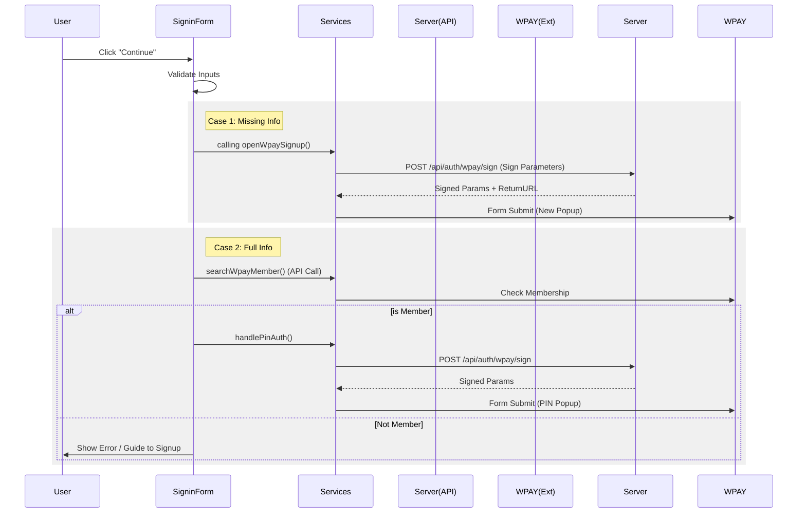

# 로그인 페이지 구현 명세 (Signin Implementation)

## 1. Overview

사용자 로그인을 처리하는 핵심 모듈입니다. WPAY(간편결제) 인증을 기반으로 하며, 자체적인 JWT 토큰 발급 프로세스를 포함합니다.

- **위치**: `src/lib/features/auth/SigninForm.svelte`
- **주요 기능**: 사용자 식별, WPAY 멤버십 확인, PIN 인증/회원가입, 토큰 발급 및 세션 관리.

## 2. UI Structure

로그인 화면은 단일 컴포넌트(`SigninForm`) 내에서 상태에 따라 UI를 제어하며, 하위 컴포넌트로 기능을 분할합니다.

- **Main Component**: `SigninForm.svelte`
  - 전체 로그인 로직 및 상태 관리 (State Management).
  - WPAY 팝업 및 결과 메시지 처리 (Message Handling).
- **Sub Component**: `AuthUserInfo.svelte`
  - 사용자 입력 폼 (User ID, Phone Number).
  - 입력값 바인딩 및 유효성 검사 UI (Input Validation).
- **Modal**: `WpayResultModal.svelte`
  - WPAY 인증 실패 또는 처리 결과 표시.
  - 반응형 디자인 (Desktop: Table / Mobile: Cards).

### 2.1. Component Interface (Props)

`SigninForm`은 페이지 형태뿐만 아니라 모달 내에서도 사용 가능하도록 설계되었습니다.

| Prop | Type | Default | Description |
| :--- | :--- | :--- | :--- |
| `isModal` | `boolean` | `false` | 모달 모드로 동작 여부. `true`일 경우 로그인 성공 후 페이지 이동 대신 `onComplete` 코드를 실행합니다. |
| `onComplete` | `() => void` | `undefined` | 로그인 성공 시 실행될 콜백 함수 (isModal: true 일 때 사용). |

### 2.2. Modal UI Specification (WpayResultModal)

WPAY 인증 프로세스 중 발생하는 결과(성공/실패)를 사용자에게 상세히 표시하기 위한 모달입니다.
특히 **개발 및 디버깅**을 돕기 위해 암호화된 원본 값과 복호화된 값을 대조하여 보여줍니다.

- **Header**: 타이틀(`title`) 및 닫기 버튼.
- **Body**: 결과 데이터 목록(`data`)을 표시.
  - **Desktop**: 3단 테이블 구조

        | 항목 (Key) | 값 (Encrypted/Raw) | 해독 값 (Decrypted) |
        | :--- | :--- | :--- |
        | `label` <br> `key` | `encrypted` | `decrypted` |

  - **Mobile**: 카드형 리스트 구조.
- **Footer**: 확인 버튼(`onConfirm` Action).

## 3. Data Flow & Inter-Process Communication

### 3.1. Initialization

1. **Mount**: 컴포넌트 마운트 시 `onMount` 실행.
2. **Listener Setup**:
    - `BroadcastChannel("wpay_channel")`: 탭/팝업 간 통신 채널 수신 대기.
    - `window.addEventListener("storage")`: 로컬 스토리지 변경 감지 (Fallback communication).
3. **Cache Load**: `localStorage`("sign-in-page")에서 마지막 로그인 정보(UserId, Phone, Settings) 로드.
4. **Auto Login**: 유효한 쿠키(`accessToken`) 존재 시 `/api/auth/validate` 호출 -> 유효하면 메인 페이지 리다이렉트.

### 3.2. Authentication Flow (WPAY)

사용자가 "Continue with WPAY" 버튼 클릭 시 실행되는 흐름입니다.



### 3.3. Result Handling

WPAY 팝업에서 인증 완료 후, 결과 데이터가 `handleWpayMessage`로 전달됩니다.

1. **Receive Data**: `BroadcastChannel` 또는 `window.opener`를 통해 데이터 수신.
2. **Security Verification**:
    - **Client**: 수신한 `signature` 값을 서버로 전송하여 검증 요청.
    - **Server**: `POST /api/auth/wpay/verify`
        - 서명 검증 수행.
        - 민감 데이터(SEED 암호화) 복호화 수행.
    - **Result**: `isSigValid`가 `false`면 에러 처리.

### 3.4. Token & Session Management

WPAY 인증 성공 후, 메인 화면으로 이동하기 전에 수행되는 세션 생성 및 관리 절차입니다.

1. **JWT 생성 요청**:
    - API: `POST /api/auth/token`
    - Parameters: `wpayUserKey`, `wtid`, `userId`, `mid`
    - Server Action: 유효성 검증 후 **JWT String** (`accessToken`) 반환.

2. **Client Storage (Cookie)**:
    - 브라우저 쿠키에 토큰을 저장하여 세션을 유지합니다.
    - **Key**: `accessToken`
    - **Expiry**: 1일 (`setCookie(..., 1)`)

3. **State Management (Store)**:
    - `profileStore.updateProfile(...)`을 호출하여 전역 스토어에 사용자 정보를 동기화합니다.
    - 저장 데이터: `userId`, `avatarUrl`, `saveDateTime` 등.

4. **Redirection**:
    - 모든 저장이 완료되면 `goto('/')`를 통해 메인 페이지로 이동합니다.

## 4. Key Functions (SigninForm.svelte)

| Function Name | Description |
| :--- | :--- |
| `onMount` | 초기화, 이벤트 리스너 등록, 자동 로그인 체크. |
| `handleNextClick` | 입력값에 따라 회원가입 또는 멤버십 체크 분기 처리. |
| `handleMembershipCheck` | WPAY API를 통해 사용자 가입 여부 확인. |
| `handlePinAuth` | PIN 인증 팝업 호출 프로세스 시작 (서명 요청 -> 폼 전송). |
| `openWpaySignup` | 회원가입/본인인증 팝업 호출 프로세스 시작. |
| `handleWpayMessage` | WPAY 인증 결과 수신, 서버 검증 요청(Verify), 결과 분기 처리. |
| `handleAccessTokenCreation` | 최종 승인 단계. 자체 JWT 발급 및 세션 생성. |

## 5. Configuration & Constants

- **File**: `src/lib/types/wpay.ts`
- **Values**:
  - `MID`: 'INIwpayT03' (Merchant ID)
  - `URLS`:
    - Member Search: `https://wpay.inicis.com/stdwpay/apis/schMemRegInfo`
    - Signup: `https://wpaystd.inicis.com/stdwpay/std/u/v1/memreg`
    - Pin Auth: `https://wpaystd.inicis.com/stdwpay/std/u/v1/pinno/auth`

### 5.2. Client Storage Schema (LocalStorage)

로그인 정보 저장을 위해 `localStorage`를 사용합니다.

- **Key**: `sign-in-page`
- **Structure**:

    ```json
    {
      "userId": "string",       // 사용자 ID
      "hNum": "string",         // 휴대폰 번호
      "isSaveCache": boolean,   // '정보 저장' 체크박스 상태
      "wpayUserKey": "string"   // (Optional) WPAY 사용자 키
    }
    ```

### 5.3. Development Features

개발 및 테스트 효율성을 위한 기본 설정입니다.

- **Default User ID**: `wpayTestUser01` (코드 내 `$state` 초기값)

## 6. Services

- **WpayAuthService** (`src/lib/features/auth/services/wpayAuthService.ts`)
  - `openPopup(width, height)`: 중앙 정렬 팝업 윈도우 오픈.
  - `submitForm(action, method, payload)`: `wpay-auth-popup` 타겟으로 Form 동적 생성 및 전송.
