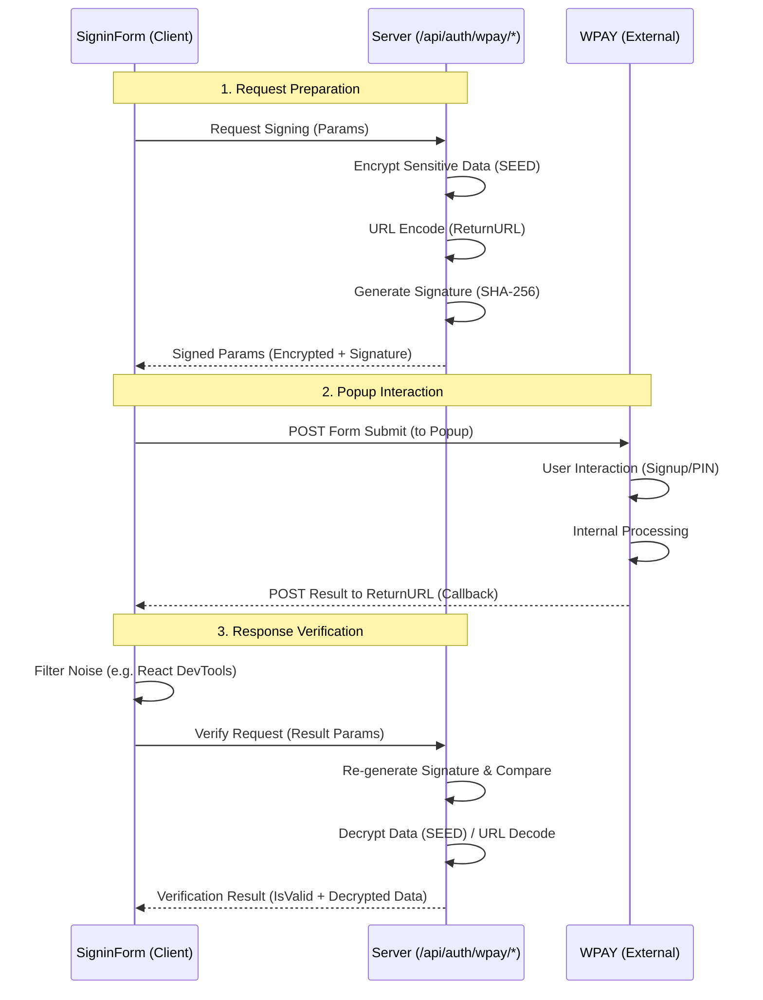

# WPAY 연동 상세 프로세스 (WPAY Process Detail)

## 1. 개요

로그인 화면에서 수행되는 WPAY 관련 비즈니스 로직의 상세 명세입니다. 외부 서비스 팝업 호출, 데이터 암/복호화, 서명 검증 등의 절차를 다룹니다.

## 2. 요청 프로세스 (Request Process)

클라이언트(`SigninForm`)에서 `/api/auth/wpay/sign` API를 호출하여 서명된 파라미터를 획득하고, 이를 팝업을 통해 WPAY로 전송합니다.

### 2.1. Request Parameters & Security

요청 타입(`signup` vs `pin_auth`)에 따라 파라미터 구성과 암호화 대상이 다릅니다.

#### Type A: 회원가입/본인인증 (Signup)

* **Target URL**: `https://wpaystd.inicis.com/stdwpay/std/u/v1/memreg`
* **Parameters**:

    | Parameter | Description | Encryption (SEED) | URL Encoding | Note |
    | :--- | :--- | :---: | :---: | :--- |
    | `mid` | 상점 ID | X | X | |
    | `userId` | 사용자 식별값 | **O** | X | 암호화 필수 |
    | `ci` | 연계정보 (CI) | X | X | 빈 값 허용 |
    | `userNm` | 사용자명 | X | X | 빈 값 허용 |
    | `hNum` | 휴대전화번호 | X | X | 빈 값 허용 |
    | `hCorp` | 통신사 | X | X | 빈 값 허용 |
    | `birthDay` | 생년월일 | X | X | 빈 값 허용 |
    | `socialNo2` | 주민번호 뒷자리 | X | X | 빈 값 허용 |
    | `frnrYn` | 외국인 여부 | X | X | 빈 값 허용 |
    | `returnUrl` | 결과 수신 URL | X | **O** | Client에서 인코딩 |
    | `signature` | 위변조 방지 서명 | - | - | 생성된 값 |

#### Type B: PIN 인증 (PIN Auth)

* **Target URL**: `https://wpaystd.inicis.com/stdwpay/std/u/v1/pinno/auth`
* **Parameters**:

    | Parameter | Description | Encryption (SEED) | URL Encoding | Note |
    | :--- | :--- | :---: | :---: | :--- |
    | `mid` | 상점 ID | X | X | |
    | `wpayUserKey` | WPAY 사용자 키 | **O** | X | 암호화 필수 |
    | `ci` | 연계정보 (CI) | X | X | 빈 값 허용 |
    | `returnUrl` | 결과 수신 URL | X | **O** | Client에서 인코딩 |
    | `signature` | 위변조 방지 서명 | - | - | 생성된 값 |

### 2.2. Signature Generation Strategy

서버(`wpayService.ts`)에서 다음 규칙에 따라 서명(`signature`)을 생성합니다.

1. **Source String 구성**: 정의된 **Signing Order** 순서대로 `key=value` 쌍을 `&`로 연결합니다.
    * *Signup Order*: `mid`, `userId`, `ci`, `userNm`, `hNum`, `hCorp`, `birthDay`, `socialNo2`, `frnrYn`, `returnUrl`
    * *PIN Auth Order*: `mid`, `wpayUserKey`, `ci`, `returnUrl`
    * *Note*: 인코딩이 필요한 필드(`returnUrl`)는 인코딩된 값을 그대로 사용합니다.
2. **Add Hash Key**: 마지막에 `&hashKey={YourHashKey}`를 추가합니다.
3. **Hashing**: 완성된 문자열을 **SHA-256** 알고리즘으로 해싱하여 **Hex String**으로 변환합니다.

### 2.3. Popup Flow Strategy

브라우저 팝업 차단을 방지하고 안정적인 통신을 위해 다음 전략을 사용합니다.

1. **Open Empty Popup**: 사용자 클릭(UI Event) 직후 `window.open("", "wpay-auth-popup")` 호출.
2. **Get Signed Data**: 백그라운드에서 `/api/auth/wpay/sign` 호출하여 데이터 확보.
3. **Submit Form**: `target="wpay-auth-popup"`으로 설정된 Form을 동적으로 생성하여 `POST` 전송.

65:

### 2.4. Data Security & Flow Visualization

요청에서 응답, 그리고 처리 결과 반환까지의 보안 데이터 흐름은 다음과 같습니다.



---

## 3. 응답 및 결과 처리 (Response & Callback)

### 3.1. Callback Mechanism

WPAY 인증이 완료되면, WPAY 서버는 `returnUrl` (`/callback/wpay/result`)로 결과 데이터를 `POST` 전송합니다.

1. **Server Receiver** (`+page.server.ts`):
    * POST Body 데이터를 파싱하여 `form` 객체로 Client Component에 전달합니다.
2. **Client Receiver** (`+page.svelte`):
    * `BroadcastChannel("wpay_channel")` 및 `window.opener.postMessage` 두 가지 방식을 모두 사용하여 부모 창(`SigninForm`)에 데이터를 전달합니다.
    * 데이터 전달 후 `window.close()`로 팝업을 닫습니다.

### 3.2. Response Parameters & Verification

수신된 데이터(`resData`)는 보안을 위해 **서버 검증(/api/auth/wpay/verify)** 과정을 거쳐야 합니다.

#### Response Parameters

| Parameter | Description | Encryption (SEED) | URL Decoding | Verify Order (Signup) | Verify Order (PIN) |
| :--- | :--- | :---: | :---: | :---: | :---: |
| `resultCode` | 결과 코드 | X | X | 1 | 1 |
| `resultMsg` | 결과 메시지 | X | **O** | 2 | 2 |
| `mid` | 상점 ID | X | X | 3 | 3 |
| `wtid` | WPAY 트랜잭션 ID | **O** | X | 4 | 4 |
| `userId` | 사용자 ID | **O** | X | 5 | - |
| `wpayUserKey` | WPAY 사용자 키 | **O** | X | 6 | 5 |
| `ci` | 연계정보 | X | X | 7 | - |
| `signature` | 응답 서명 | - | - | - | - |

#### Verification Logic

서버(`/api/auth/wpay/verify`)에서 다음 절차를 수행합니다.

1. **Identify Type**: `userId`와 `ci` 값의 유무로 인증 타입을 구분합니다. (없으면 PIN Auth)
2. **Validate Signature**:
    * 위 표의 **Verify Order** 순서대로 파라미터를 조합하여 서명을 재생성합니다.
    * 재생성된 서명과 `resData.signature`가 일치하는지 확인합니다.
3. **Decrypt / Decode Data**:
    * `wtid`, `userId`, `wpayUserKey` 필드에 대해 **SEED 복호화**를 수행합니다.
    * `resultMsg` 필드에 대해 **URL Decoding**을 수행합니다.
4. **Result Return**: 검증 및 처리 완료된 데이터를 클라이언트로 반환합니다.

#### Verify API Response Schema

`/api/auth/wpay/verify`가 반환하는 JSON 구조입니다.

```json
{
  "isSigValid": boolean,      // 서명 검증 성공 여부
  "decrypted": {              // (Optional) 복호화된 데이터 객체
    "resultCode": "string",
    "resultMsg": "string",    // URL Decoded Message
    "mid": "string",
    "wtid": "string",         // Decrypted WTID
    "userId": "string",       // Decrypted UserID
    "wpayUserKey": "string"   // Decrypted WpayUserKey
  },
  "error": "string"           // (Optional) 에러 메시지
}
```

### 3.3. Error Handling & Finalization

클라이언트는 검증된 데이터를 바탕으로 다음과 같이 분기 처리합니다.

#### 1. 서명 검증 실패 (Signature Verification Failed)

서버 검증 단계에서 서명이 일치하지 않는 경우(`isSigValid: false`), 즉시 에러 모달을 표시합니다.

* **UI 동작**: `WpayResultModal` 표시 (Action: "CLOSE")
* **표시 데이터**:
  * 서명 상태: `INVALID (서명 불일치)`
  * 결과 코드/메시지: 암호화된 원본 데이터 표시 (복호화 불가하므로)

#### 2. WPAY 결과 오류 (Result Code Error)

서명은 유효하지만, WPAY 비즈니스 로직상 실패한 경우입니다. (성공 코드: `"0000"`, `"2006"`)

* **성공 코드 정의**:
  * `"0000"`: 정상 처리 완료.
  * `"2006"`: 정상 처리 완료 (일부 케이스에서 반환됨).
* **UI 동작**: `WpayResultModal` 표시 (Action: "CLOSE")
* **표시 데이터**:
  * 타이틀: `WPAY PIN Auth Result` 또는 `WPAY Member Sign-up Result`
  * 에러 메시지: `resultMsg` (URL Decoded)
  * 상세 정보: `resultCode`, `wtid` 등 복호화된 정보 표시

#### 3. 성공 처리 (Success)

모든 검증을 통과하고 결과 코드가 성공(`"0000"` or `"2006"`)인 경우입니다.

* **Action**: 자체 Access Token 발급 요청 (`handleAccessTokenCreation`)
* **Completion**: 토큰 쿠키 저장 및 메인 페이지 이동.

#### 4. 예외 발생 및 노이즈 필터링 (Exception & Filtering)

네트워크 오류 또는 기타 예외 발생 시 `alert`을 통해 사용자에게 알립니다.

* **Noise Filtering**: `BroadcastChannel` 수신 시 `source`가 `react-devtools` 등을 포함하는 경우, 불필요한 메시지로 간주하여 무시(return)합니다.

---

## 4. 보안 및 키 관리 (Security & Key Management)

WPAY 연동에 사용되는 암호화 키와 해시 키는 보안상 매우 민감한 정보이므로, **Server-Side**에서만 접근 가능하도록 엄격하게 관리됩니다.

### 4.1. Key Storage

* **위치**: `$env/dynamic/private` (SvelteKit Server-Side Environment)
* **파일**: `.env` (로컬) / Server Environment Variables (배포 환경)
* **로드 방식**: `src/lib/server/wpayKeys.ts`를 통해 로드하며, 클라이언트 번들에 포함되지 않습니다.

### 4.2. Helper Service

* **Service**: `wpayServerService` (`src/lib/server/services/wpayService.ts`)
* **역할**: `MID`를 기반으로 적절한 환경변수 키를 조회하여 암/복호화 및 서명 작업을 전담합니다.
* **접근 제어**: API Route(`+server.ts`)에서만 import하여 사용합니다.

### 4.3. Required Keys

각 상점 ID(`MID`) 별로 다음 3가지 키가 필수적으로 설정되어야 합니다.

| Key | Environment Variable | Description |
| :--- | :--- | :--- |
| **Seed Key** | `WPAY_SEED_KEY` | 데이터 암/복호화용 128bit 키 (SEED-CBC) |
| **Seed IV** | `WPAY_SEED_IV` | 암호화 초기화 벡터 (IV) |
| **Hash Key** | `WPAY_HASH_KEY` | 서명 생성용 해시 키 (SHA-256 HMAC or Concatenation) |
